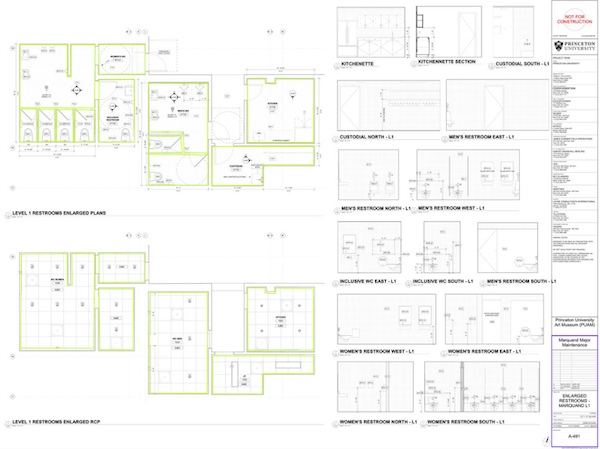
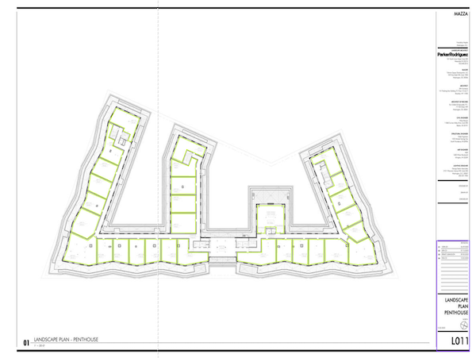

# Construction Plan Analyzer
**Selected tasks:** detect rooms & extract info    

------------------------------    

## TL;DR
The easiest way to run this system is first to visit [Hello TrueBuilt](http://52.59.220.149) and check if API is working (My EC2 could stop because some maintance or exceeding treshold)

Clone this repository: `https://github.com/mlkonopelski/construction_plan_analyzer.git` or use or own example .pdf 

### Page Info retrieval:
```
curl -X POST -F "file=@data/test/A-492.pdf" -F "find_page_info_method=detection" -H "authorization: Bearer TOKEN" http://52.59.220.149/page_info/
```   
### Rooms detector
```
curl -X POST -F "file=@data/test/A-492.pdf"  -H "authorization: Bearer TOKEN" http://52.59.220.149/rooms/
```   

the token was provided by email to: **Vin**. The inferance can take a bit of time because I used cheap t2.large.


## Aproach 
Because rooms can take any size and shape instead of doing bounding box detection I decided to predict regions and label the training data accoradingly.  




The dataset consisted of 9 PDF files, two of which (`A-192.pdf`, `A-492.pdf`) I used as **out-of-sample** just to verify how well are we doing and to verify API. I chose those to in particular because I thought they best represnt this dataset. 

There was no definition of room therefore I created my own as: "area which is surrounded by walls and at least 1 door." 

While the time was constrained I tried to develop the app to achieve two goals:
1. ML models (test few frameworks) of reasonable accuracy
1. API and DevOps of reasonable advancement 

# Results
## Page Info retrieval
I'm quite satisfied with how the algorithms which:
1) finds the panel with information 
2) detects bbox of particular detail
3) perform OCR

### A-492
1. detection on panel  
   

1. json result   
```json
{
  "imageId": "A-492.pdf",
  "sheet_name": "ENLARGED RESTROOMS MARQUAND L2 & L3",
  "sheet_number": "A-492",
  "revision": [
    {
      "number": 2,
      "date": "2023-03-31",
      "description": "100% DD"
    }
  ]
}
```
   
There is still a small bug because EasyOCR doesn't correctly OCR this line even if it looks pretty clear:    
 
log: `Missing 1 or more keys from revision: {'date': '2022-11-23', 'description': '100% SD'}`

### _13
It was int training set but since it has a different structure of that panel I decided to include it here as prediction also
1. detection on panel  
   
While there are more potential bboxes for Revision I added a safety feature that counts elements and == 3

2. json result
```json
{
  "imageId": "_13.pdf",
  "sheet_name": "LANDSCAPE PLAN PENTHOUSE",
  "sheet_number": "LO11",
  "revision": [
    {
      "number": 3,
      "description": "PERMIT SUBMISSION",
      "date": "2022-09-30"
    },
    {
      "number": 4,
      "description": "95% CD",
      "date": "2022-12-02"
    },
    {
      "number": 2,
      "description": "50% CD",
      "date": "2022-07-15"
    },
    {
      "number": 1,
      "description": "100% DD",
      "date": "2022-04-29"
    }
  ]
}
```

## Rooms detection
TBH I'm not happy with the results. My approach was too basic to solve the task with such limited amount of training data.   


However the model learned the basic features what can be seen on training samples of different kinds so it's clearly a problem with generalization. 


# In-depth ML
## Approaches
### General
Since the panel with all important details of the construction plan (page number, sheet name and Revision) is on the same page as building plan I decided to follow two step approach:
1. Find regions of all rooms
2. Find region of description with information to extract
    1. Cut the region from original plan size: 24k x 18k so the text is easily visible
    2. Run bbox detection of each field of interest. 
    3. Run OCR Tesseract/Easy-OCR on results. 

### Rooms Detection
1. Image Segmentation with YOLOv8 with following specs:
    1. Two classes: Rooms + Description
    1. Architecture: Yolov8 Medium from ultralytics
    1. Original Images resized to 2400x1800
    1. No augmentations what resulted in heavy overfit
1. Same as above but:
    1. Multiple Augmentations: rotation, scale, translation, random flips. While I don't think they represent possible samples in future it should reduce overfitting
    2. Result are not satifactory especially low number of recall of rooms:  
     
1. Since construction blueprints have easy to distinguish lines I worked also on classical CV approach to find structures on images. Two things were tested (`utils/classic_algorithms.py`) but need more attention in order to process output data. To test those approaches building floor was cropped from entire image manually (but automatic solution wouldn't be difficult). 
    1. Canny + HoughLines
    Since walls are usually straight lines I used Canny algorithm to distinguish all outlines of shapes and HoughLine probability t0 leave only straight lines. The output is still messy and as next step I would use some unsupervised algorithm to leave only one line
    
    1. Watershed segmentation
    Any grayscale image can be viewed as a topographic surface where high intensity denotes peaks and hills while low intensity denotes valleys. Construction blueprints seems natural for this purpose since there is high contrast between walls and background. As a next step I would test two things (which I didn't have time to do): a) clustering algorithm or more probable b) classical classification were each sample would be cropped from large plan
    
1. This approach is kinda crazy. Looking at those PDF I realized that they are so big because they include vectors so all the details like walls and text. I don't know how to do it with python but I extracted those vectors using Inkscape:  
  
and the underlying data looks like this:  
   
I don't have expertise but maybe it can be used with semi-suprvised learning to find walls and later build rooms inside

### OCR "Page Info"
As a easier solution I firstly cut that panel at size common for all training samples. The bbox detection of it was created in case that panel changes position.
1. All 7 training examples were slightly augmented and used for training bounding boxes. I tried YOLOv8 nano, small and medium and surprisingly only medium was giving good results (I anticipated that nano would be suffficient). 
The model gives sufficient results on `A-192` and `A-492` test images:  
 


# RUN the detection software locally
### Using pre-built docker image
```
docker pull public.ecr.aws/i5l4l1q2/true-built:latest
docker run -d -p 8008:8000 --name true-built-ai public.ecr.aws/i5l4l1q2/true-built:latest

curl -X POST -F "file=@data/test/A-492.pdf" -F "find_page_info_method=detection" -H "authorization: Bearer TOKEN" http://localhost:8008/page_info/
```
### Build from source
```
git clone https://github.com/mlkonopelski/construction_plan_analyzer.git
cd construction_plan_analyzer
docker compose -f docker_compose.yaml up --build --detach

curl -X POST -F "file=@data/test/A-492.pdf" -F "find_page_info_method=detection" -H "authorization: Bearer TOKEN" http://localhost:8008/page_info/
```