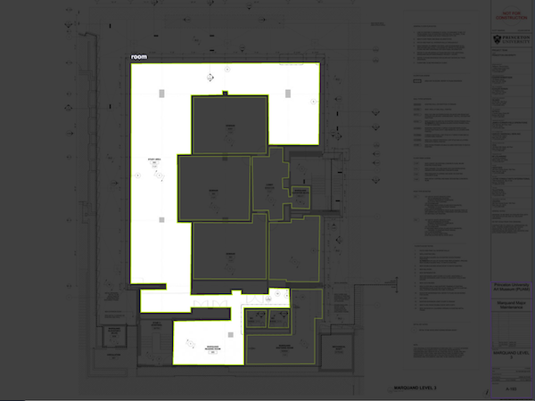

# Construction Plan Analyzer
**Selected tasks:** detect rooms & extract info    

------------------------------    

## TL;DR
The easier way to run this system is by:
```
curl -X POST -F "image=@extracted_page_xyz.png"  "http://localhost:3000/run-inference?type=wall" #TODO
```
the token was provided by email to: **Vin**. Please don't ruin me on AWS fees :) 


## Aproach 
Because rooms can take any size and shape instead of doing bounding box detection I decided to predict regions and label the training data accoradingly.  



The dataset consisted of 9 PDF files, two of which (`A-192.pdf`, `A-492.pdf`) I used as **out-of-sample** just to verify how well are we doing and to verify API. I chose those to in particular because I thought they best represnt this dataset. 

There was no definition of room therefore I created my own as: "area which is surrounded by walls and at least 1 door." 

While the time was constrained I tried to develop the app to achieve two goals:
1. ML models (test few frameworks) of reasonable accuracy
1. API and DevOps of reasonable advancement 

# Results
The results...

# In-depth ML
## Approaches
### General
Since the panel with all important details of the construction plan (page number, sheet name and Revision) is on the same page as building plan I decided to follow two step approach:
1. Find regions of all rooms
2. Find region of description with information to extract
    1. Cut the region from original plan size: 24k x 18k so the text is easily visible
    2. Run bbox detection of each field of interest. 
    3. Run OCR Tesseract/Easy-OCR on results. 

### Rooms Detection
1. Image Segmentation with YOLOv8 with following specs:
    1. Two classes: Rooms + Description
    1. Architecture: Yolov8 Medium from ultralytics
    1. Original Images resized to 2400x1800
    1. No augmentations what resulted in heavy overfit
1. Same as above but:
    1. Multiple Augmentations: rotation, scale, translation, random flips. While I don't think they represent possible samples in future it should reduce overfitting
    2. Result are not satifactory especially low number of recall of rooms:
    
    

